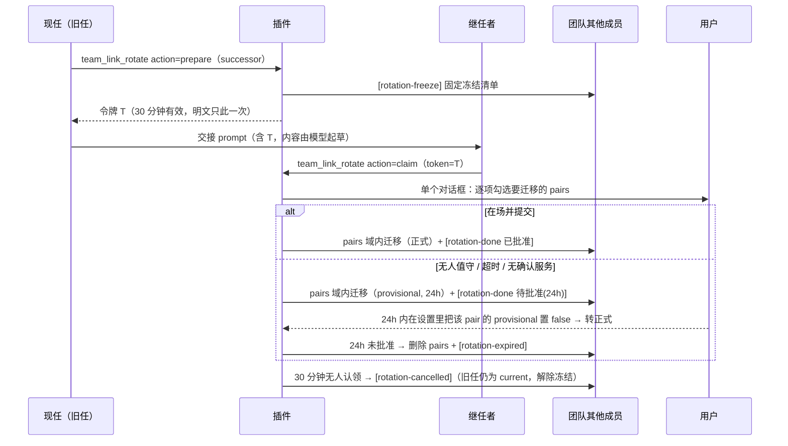

# dsh-team-link

> **更名通告（0.3.0）**：本插件原名 `dsh-session-link-pro`（0.2.4 及之前）。自团队升级（roster / 看门狗 / 广播 / 换届，见 `docs/team-upgrade-design-2026-09-17.md`）起，上游血统仅剩深链解析一段，故独立更名 `dsh-team-link`。历史日志中的 `session_link_pro_*` 工具名与 `slp-` 消息 id 前缀均为改名前记录，保持原样；`slp-` 前缀在改名后继续沿用（日志取证连续性）。首次加载 0.3.0 时自动把旧 `session-link-pro` 设置命名空间的信任数据（pairs / trustedSenders 等）迁移到 `team-link`。GitHub 仓库暂未改名，旧地址自动重定向。

[DeepSeek Harness (DSH)](https://github.com/deepseek-ai) 的会话互联插件——[dsh-session-link](https://github.com/PwnKY/dsh-session-link) 的增强 fork。

在一个 DSH 实例里开多个会话干活时，会话之间是隔离的：看不到别的会话在干嘛、没法把 A 会话的结论交给 B 会话继续、想归档一个会话只能翻 UI。本插件补上这三块：

| 能力 | 说明 | 入口 |
| --- | --- | --- |
| 🔗 会话深链 | 复制 `dsh://session/<id>`，粘贴到任意会话即注入该会话只读快照（上游功能） | 会话头部按钮 / 粘贴链接 |
| 📋 会话列表 | 列出同工作区其他会话：主题、运行状态、最近消息摘要，以及**活性信号行**（verdict 五态 + goal 状态 + 静默时长 + 读数时效戳）。会话日志（surface）**只读前 12 行**且并行读——第 13 行起的活性行是「未读（超出快照窗口）」 | `team_link_list_sessions` |
| ⬇ 会话导出 | 全量事件导出为 markdown（可读）+ JSON（无损） | `team_link_export` / 会话头部 ⬇ 按钮 |
| 📨 跨会话消息 | 向另一会话投递消息，空闲目标自动唤醒并作为新回合响应；返回文案带 **busy 预判**（目标运行中时给出其当前回合已运行的分钟数与 steer 语义）。目标没有活动代理时以 **`❌ 未投递`** 开头并列出同工作区其他存活会话（自愈提示，绝不可读成「已发送」） | `team_link_send` |
| 📣 广播 fan-out | 一次投递给多个目标：会话 id / `team:<name>/<role>` / `team:<name>/*`（全队，仅该团队现任协调者）。逐目标独立过门、≤8 目标、逐目标结果行 + 汇总；**只要有一个目标未投递，返回首行就是 `❌ N 个目标未投递（M 个已投递）`** | `team_link_send` 的 `targets` |
| 🏷 信封 banner | 可选 `meta`（type / pri / ref）渲染进投递 banner 首行，接收方与导出审计一眼看清消息性质；不扩 `source`（V10） | `team_link_send` 的 `meta` |
| 🔁 配对通道 | 双方各批准一次后，两个会话互发消息免确认（自动联调） | 接收确认时选「配对」 |
| 🐕 跨会话看门狗 | 给自己注册盯人：被盯会话出现失联征兆且你空闲时，插件向你自己的会话投递一条固定文案的 tick | `team_link_watch` |
| 🎭 团队 roster | 团队 → 角色 → 会话的身份注册表，含**版本史**（退役≠删除）与写入策略（默认只有现任协调者会话可写）；`<workspace>/team/<name>/roster.md` 是人可读镜像 | `team_link_roster` |
| 📋 团队黑板 | `<workspace>/team/<name>/` 下的 `decisions.md`（只追加的裁决账本，seq 由插件分配）与 `discipline.md`（整文件替换，baseHash 乐观锁）；任何会话可读可写，写入者记在行内 author | `team_link_team_read` / `team_link_team_append` |
| 🔄 团队换届 | 两阶段交接：现任 `prepare` 出**一次性令牌**（绑定 team+role+successor，30 分钟）并广播冻结；继任者凭令牌 `claim`——单个对话框逐项勾选要迁移的免确认通道，域限定迁移 + 退役者信任对称吊销；无人值守则 provisional + 24h 自动回退 | `team_link_rotate` |

## 跨会话消息语义

- 目标**运行中** → `steer`：消息在步边界注入其当前回合
- 目标**空闲** → `followup`：唤醒目标会话，消息作为**新回合**处理（立即显示消息并触发 LLM 响应，不会静默排队）
- 目标**没有活动代理**（id 转录错位、会话已关闭、刚重启 DSH 后尚未在侧边栏打开过）→ 拒绝文案以 **`❌ 未投递`** 开头（不许被读成「已发送」），保留原句「目标会话 `<id>` 没有活动代理」，并**列出当前同工作区其他存活会话**（`id（运行中/空闲）`，上限 10 个；更多时注明「共 N 个，仅列前 10 个」）与核对提示（对照 id / 在侧边栏打开目标会话一次使其恢复为活动代理 / 先调 `team_link_list_sessions`）。该列表是**纯 agent 注册表读取**（不读会话日志，零 surface 读取、无性能代价），只列**根代理**、同 `cwd`、且非发起者自身——子代理不会被列为可投递目标；执行上下文没有会话身份时（插件内部通知路径）只知道「非自身」，此时跳过 cwd 过滤并列力所能及的全部存活会话。无匹配时输出「当前工作区无其他存活会话。」
- 投递的消息 `source = { kind: "agent-message", form: "relay", senderSessionId }`——**恰好这三个成员**，这是 DSH 0.1.5 会话日志迁移唯一接受的跨会话中继形状（见下「会话格式兼容」）。发送方/时间/插件名都写在正文 banner 里（`📨 [跨会话消息 · 来自会话 <id> · <本地时间>]`；M3 起可选信封 `meta` 追加在同一行，见下「信封 banner」），接收方模型可直接看到并可用同一工具回发。消息 id 固定为 `slp-<uuid>`，UI 卡片靠它把自己的中继与上游相邻代理消息区分开。

### 批准门与配对

未配对时每次发送过两道门：

1. **发送方确认**：发送 / 记住该目标免确认 / 取消
2. **接收方策略**（`receiveMode: ask` 时）：接收 / 总是接收该发送方 / **配对：双向免确认** / 拒绝并屏蔽（超时约 3 分钟按取消处理）

接收方选择「配对」即在设置中写入 `pairs: [{a, b, createdAt}]`，此后这两个会话**双向免确认**直接投递；「拒绝并屏蔽」写入 `blockedSenders` 并自动解除配对——屏蔽始终优先于配对。

### 广播 fan-out（`targets`，M3）

`team_link_send` 一次可以发给多个目标。`targets` 与 `targetSessionId` **互斥**：两者都给是参数错误，两者都不给也是参数错误（单目标语义不变）。

| `targets` 项 | 解析优先级 | 谁能用 |
| --- | --- | --- |
| `session-xxx` | 直达该会话（最高优先级） | 任何会话 |
| `team:<name>/<role>` | 该角色的现任会话 | 任何会话；角色当前空缺（或该团队没有这个角色）→ **`no-holder` 结果**（不算投递也不算失败） |
| `team:<name>/*` | 全队：该团队全部**在任且存活**的角色（不含发起者自身） | **仅该团队现任协调者会话**，否则整次调用拒绝——理由见《调研》§5.3 论据 (a)：协调者的价值部分在于策展每个 worker 看到什么，而 flash worker 最稀缺的资源是上下文 |

- 单次最多 **8** 个目标（§4.1 防偏离），超出即拒绝；团队不在 roster 中或表达式形状非法 → **整次调用拒绝**（一条都不投，不做「半发」）；
- fan-out **不放宽任何门**：每个目标都照走完整的单目标路径（屏蔽检查 → 配对快路径 → 发送方确认 → 接收方策略 → steer/followup）。N 个未配对目标就是 N 次批准；确认服务不可用时逐目标 fail-closed；
- 返回逐目标结果行 `- <会话 id>[（via <表达式>）] → delivered | refused | no-agent | no-holder：<摘要>`，末行是汇总：

  `汇总：N 投递 / M 拒绝[ / A 无活动代理][ / K 空缺目标（no-holder，不计入投递与失败）][ / D 个重复目标已去重]。`

- **失败领先**：只要有一个目标的结果不是 `delivered`，返回文案的**第一行**就是 `❌ N 个目标未投递（M 个已投递）`（N 含 refused / no-agent / no-holder——消息确实没到这些目标手里；用词是「未投递」而不是「失败」，故与汇总里 no-holder 的独立桶不矛盾），其后才是 `广播 fan-out：…` 头行、逐目标结果行与汇总行。**全部投递成功时文案形状一字不变**（无 ❌ 行）。这条是为一次生产误读而加：协调者把「1 投递 / 2 拒绝」读成了「已广播」；
- 重复的会话 id（含不同表达式解析到同一会话）**去重后只投一次**，去重个数写在汇总里。

### 信封 banner（`meta`，M3）

可选 `meta: { type?: 'ruling'|'receipt'|'report'|'ask', pri?: 'P0'|'P1'|'P2', ref?: string }` 渲染进 banner **首行**的紧凑字段，只出现调用方给的键：

```
📨 [跨会话消息 · 来自会话「X」(session-x) · 2026-09-17 23:42:05 · type=ruling pri=P0 ref=slp-a1b2]
```

- `ref` 超过 **16 字符**按码点截断（不会切半 emoji），并在工具返回文案里明确注明截断前后；
- 枚举外的 `type`/`pri`、§3.4 未定义的字段、非对象 `meta`、空 `ref`、含换行的 `ref` → **明确参数错误、整次调用拒绝**（不静默丢弃、不部分采用）；
- fan-out 时所有目标共享同一 `meta`；
- **`source` 仍是恰好三成员**（V10 红线）：信封只走正文 banner，不扩 source、不做 sidecar 索引。

### busy 预判（M3）

投递成功的返回文案附带目标忙碌状态（fan-out 时逐目标独立）：

- 目标**运行中** → 追加 `目标回合已运行 N 分钟（steer 注入当前回合）；需新回合语义请等其空闲`。`N` 取自 M1 的 `turnStartedAt`（= `team_link_list_sessions` 活性行里的「回合始于」）；读不到该时间戳时只给 steer 语义、不给分钟数；
- 目标**空闲** → 保持原文案（已唤醒为目标新回合）。

### 消息卡片

接收方 UI 把跨会话消息渲染为醒目的 📡 卡片（📡 标题行 + 高亮左边条 + 发送会话 + 时间）：通过 `conversation.chat.node` keyed slot 以 `priority: -100` 影子替换 chat 包默认的折叠灰字行；非本插件消息（其他插件的 context 注入）经 `slots.entries()` 委托回原渲染器，显示不受影响。

判定条件不是「kind/form 命中」而是**本插件自己的消息**：`agent-message + relay` 正是上游相邻代理消息（`send_message`）用的形状，只按 kind/form 判断会把它们也渲染成卡片。因此卡片还要求命中本插件自己的两个特征之一——消息 id（在 chat node 上是 `node.id`，context 的 `data` 里没有 id）以 `slp-` 开头，或正文以 `📨 [跨会话消息` 开头；历史日志里的旧 `kind: "team-link"` 继续识别。卡片时间优先取旧日志的 `sentAt`，其次取 context node 自带的事件时间 `data.time`，最后才从正文 banner 里解析。

## 会话格式兼容（DSH 0.1.5）

0.1.5 的会话日志迁移（V0→V3）逐条校验每条 message 的 `source`：白名单外的 `kind`、或成员多一个少一个，都会让**整份会话日志**拒绝迁移（`SessionFormatUnsupportedMigrationError`，表现为「这个对话打不开」），且拒绝时不会破坏原始日志。旧版本的插件写的是 `kind: "team-link"`，正是这种会被拒的形状——所以 0.2.3 起改用上游自己的中继形状 `{ kind: "agent-message", form: "relay", senderSessionId }`（白名单见 `@deepseek-ai/dsh-session-format-v2-to-v3` 的 `SOURCE_KINDS`，`agent-message` 的成员集合被 `keys()` 锁死为恰好三项，多余信息只能进正文）。

已经在旧日志里的 `kind: "team-link"` 事件改不回来（`kind` 已烙在已发布的事件流里），需要外部工具改写原始日志或在导出前修复——修复方向即把 source 替换成上述三项形状，替换后迁移即可通过。

## 字符串安全：孤立代理项（0.2.4）

半截 emoji（孤立代理项，例如单独的 `U+D83D`）不是显示瑕疵。DSH 把工具结果**逐字**放进下一次模型请求的 JSON 体，非法 UTF-16 会让那次请求直接以 `400 INVALID_REQUEST` 失败；而这段文本已经写进调用方会话历史，于是**该会话此后每一条消息都以同一个 400 失败**（连 4 字符的 `test` 也一样），`INVALID_REQUEST` 又不在重试白名单里——会话永久不可恢复。

本地扫描 882 份会话日志，只有 5 份含真正的孤立代理项：走 deepseek-official 的 4 份**全部在下一次请求当场死亡**（0 条成功回复），走 qax 的 1 份存活。诚实交代：没有做重放实验（没有构造含孤立代理项的请求去打 API），这是观测相关性；但机制无争议，且「按码点截断」本来就是这两个函数应有的写法。

- **根因**：`preview()` / `truncate()` 用 `slice()` 按 **UTF-16 code unit** 截断，切割点落在代理对中间时只留下一半。凶器是列表工具的主题预览 `preview(topic, 90)`：emoji 恰好压在第 89 个 code unit 上。
- **修法一（不再制造）**：两个 helper 改为**按码点截断**（`[...str]` 按码点迭代），90 / 120 / 200 / 300 等限额与纯 BMP 文本的渲染结果完全不变；`truncate()` 的「已截断 N 字符」计数口径随之从 code unit 变成**码点**（更正确：原来一个 astral 字符被算作 2 个「字符」，却只输出一半）。
- **修法二（纵深防御）**：新增 `wellFormed()`（当前运行时用 `String.prototype.toWellFormed`，Node < 20 走等价正则）消毒**所有对外字符串**——列表工具正文、export 的 md 与 JSON、`team_link_send` 的两处批准提问正文、投递到目标会话的 banner（否则毒的是**接收方**会话）、拒绝文本里回显的目标 id（工具参数回显）、深链注入的会话快照（`agent/pre-step`，最直接进入调用方下一次请求的通道），以及三个工具 `output.render` 这最后一道模型可见出口（`dsh-tools` 正是用它把返回值变成工具结果内容块）。
- **客户端同理**：`shortSessionId()` 的 `slice(0, 14)` / `slice(-8)` 改为按码点切（`Array.from`），卡片正文、发送方 id、以及非本插件上下文文本的委托回退渲染都先过一遍 `wellFormed()`。这条路径只是显示——浏览器 DOM 的 USVString 转换本就会把孤立代理项变成 `U+FFFD`，且它不会再进入模型请求——属于显示层加固，不是会打死会话的那条链。
- **验收不变量**：本插件返回的字符串里**永远不出现孤立代理项**；把 emoji 摆在任意切割位置上，输出要么完整包含它、要么完整丢弃它。

## 活性信号与跨会话看门狗（M1）

### 活性信号（`team_link_list_sessions` 的 `活性：` 行）

每个会话行带一条活性信号（读一次 surface + 一次 agent 查询，纯服务调用，不解析日志）。

**读取是有窗口的**：只有列表前 **12** 个会话（`PREVIEW_SESSIONS`，与主题/最近摘要同一个窗口）会被读 surface，且这 12 次读取**并行**发出。第 13 行及以后照旧列出（id / 运行状态 / 创建时间 / 读数时效戳——全是零日志成本的面），但活性行降级为 `活性：未读（超出快照窗口 12）……`：verdict / 静默时长 / goal / 主题 / 最近动态一律标为未判定。一行 surface = 一次冷日志解压 + 一次表面投影，逐个串行读满列表上限（`LIST_LIMIT` = 50）在真实工作区会直接超掉工具预算——所以这里选择**有界 + 并行 + 如实标注**，而不是编一个没有读过的判定。

窗口内的字段：

| 字段 | 含义 |
| --- | --- |
| `verdict` | 五态判定（见下表） |
| `代理` | `运行中` / `空闲` / `未运行`（`ctx.agents.get(id)`） |
| `goal` | `<phase>/<activation>(<已用轮次>/<上限>)`；blocked 另带 ` blocked=<code>: <message>`；`none` = 当前无 goal（或该会话没有存活代理可问）；**`?` = goals 服务缺失（降级运行，插件功能不受影响）** |
| `静默` | `now - max(末条 assistant, 末条入站)`，分钟；两侧时间戳都读不到时显示 `?` |
| 回合始于 / 末条助手 / 末条入站 | 绝对时间戳（本地时区） |

verdict 五态（阈值：静默 10 分钟、回合 30 分钟；`team_link_watch` 的 `silentMinutes` 只影响巡逻判定）：

| verdict | 条件 | 含义 |
| --- | --- | --- |
| `dead` | 无存活代理 | 会话已关闭：只有用户能处理（A4） |
| `long-running` | 运行中且当前回合已超 30 分钟 | 可能卡住，值得看一眼 |
| `goal-disarmed` | 空闲 + goal 为 `active` 但 disarmed | **根因级静默**：activation 不持久化，重启/回合 max-tokens 结束/agent error 都会落到这里，且不会自愈 |
| `silent-idle` | 空闲 + 无 goal + 静默超阈 | P1 场景（协调者等 worker 回报） |
| `ok` | 其余，含 `paused` / `blocked` / `complete` | 已被解释的静默（在等人类决策 / 已完结）或活跃 |

读数带时间戳：每行行尾是 `（读数 YYYY-MM-DD HH:mm:ss，>2min 作废）`——活性是快照，超过 2 分钟须重新读。

### 看门狗（`team_link_watch`）

`action: register` 只能**给自己注册**（`exec.agent.id` 即观察者，且 `targets` 不能含自己——自指等于变相的自 tick 定时器）。观察者空闲、且被盯目标出现 `silent-idle` / `goal-disarmed` / `dead` 时，插件向**观察者自己的会话**投递一条固定文案的 tick；观察者醒来后自己决定轮询、转派还是上报。

tick 策略（goal 状态决定，§3.7 四态）：

| 目标 goal 状态 | tick？ | 理由 |
| --- | --- | --- |
| `armed` + `active` | 永不 | 它有自己的续跑节拍，tick 只稀释节奏 |
| `active` + `disarmed` | **立即**（不等静默阈） | 根因级静默态；tick 文案带诊断与合规 resume 回路（转告用户 → 用户授权 → 模型自己 `update_goal(action:"resume")`；**插件绝不代调 resume**） |
| `paused` / `blocked` / `complete` | 不 tick | 在等人类决策 / 已完结，只在活性行展示 |
| 无 goal | 静默超阈才 tick | P1 场景 |

观察者侧：观察者**运行中**或自身 **armed-active** 时不 tick（绝不打断运行中的回合）；观察者代理不存在时不 tick、不改注册——该会话在 `list_sessions` 活性行里本来就是 `代理=未运行` / `verdict=dead`，`team_link_watch list` 另标 `观察者=dead（代理不存在，等待用户）`，注册保留到 TTL 到期自清（代理回来了就自然恢复投递）。

限制（防失控）：单会话最多 **3** 个注册；`silentMinutes >= 10`（默认 10）；`intervalMinutes >= 5`（默认 5，即巡逻间隔）；`ttlHours <= 24`（默认 12，到点自动清理）。`clear` 幂等（不存在的 id 返回「已清理 0 个」），只能清自己的注册。

tick 的实现约定：

- **source 三成员不变**：`{ kind: "agent-message", form: "relay", senderSessionId: <观察者自身> }`（V10 白名单；watchdog 自己没有会话身份，按 §3.2.3 取方案 (a)）；
- 消息 id 前缀 `slp-wd-`；
- **正文是插件常量模板**，只有状态字段插值（目标 id / 读数时间 / 静默时长），注册参数不进入正文——注册无法给观察者的下一回合夹带提示词；
- 去抖：同一目标「同一静默期最多一次 tick」（静默期以目标的末条活动水位为界，有新活动才算新静默期），且两次 tick 之间至少隔一个巡逻间隔（`intervalMinutes`）。去抖状态是进程内 Map，**不持久化**：重启即忘，宁可多一次 tick，也不留会误判的持久状态；
- 巡逻定时器随插件 dispose 一起清理（`ctx.effect`）。

诚实声明（A4）：看门狗只能提醒**活着**的观察者。观察者或目标任一方已关闭时，没有任何机制能唤醒它——插件只在信号面标 `dead` 等用户处理；「活会话节奏维持」是真实覆盖面，「失联恢复」不是。

## 团队 roster 与团队黑板（M2）

### roster（`team_link_roster`）

`teams` 键是身份层的事实源：团队 → 角色 → 会话，带版本史。

```yaml
teams:
  - name: night-shift            # [a-z0-9-]+，工作区内唯一（也是黑板目录名）
    createdAt: 1700000000000
    workspace: D:/work/night     # 首次创建团队时从该会话的 agentCwd 捕获，之后不再改写
    policy: { writer: coordinator }   # coordinator | any
    roles:
      - role: coordinator        # 约定角色名；自定义角色（reviewer 等）由 set-role 按需创建
        current: session-abc     # 现任；null = 空缺
        pending: null            # M4 rotation 的继任槽位，M2 只原样保留
        history:                 # 版本史：一段任期一条，`until: null` 表示仍在任
          - { session: session-old, from: 1700000000000, until: 1700009999999, note: 交班 }
```

| action | 效果 | 写权限 |
| --- | --- | --- |
| `get` | 全体团队概要；指定 `team` 时给出详情（含 pending 与整段版本史） | 任何会话可读，无门 |
| `upsert-team` | 创建（默认 `policy.writer=coordinator`、workspace 取调用会话的 `agentCwd`）或幂等更新 | 已存在的团队过写权限门；**重复调用不重置 roles / 版本史 / createdAt** |
| `set-role` | `current` 替换 + 版本史追加：旧任那条记 `until=now`（带 note），新任那条以 `until: null` 打开；角色不存在则本次指定即创建。指定的会话**正是某个在飞换届 pending 的继任者**时，该令牌当场作废（评审 #9：身份已由本次显式变更，该换届不再可能用原令牌 claim——claim 报「没有 pending」，本工具返回文案里也如实说明） | 过写权限门；**不迁移 pairs**——换届的信任迁移是 M4 rotation 的专属动作（§3.3.2） |
| `retire` | `current` 置空（vacant）+ 版本史记退役（`until=now`，带 note）。退役本身不动信任数据，随后弹**一个**确认对话框列出所有仍指向该会话的 `pairs`（双向）/ `trustedSenders` / `rememberTargets`，选「清理」才删除 | **仅现任协调者会话**或用户发起（§3.3.2 v1.3 逐字实现，与 `policy.writer` 无关） |

写权限（`policy.writer`）：

- `coordinator`（默认）：只有 `coordinator` 角色的**现任**会话（`exec.agent.id` 比对）可写；
- `any`：任何会话可写；
- `coordinator` 而现任空缺（`current: null`）：**一切会话调用都被拒绝**，提示改设置。这一条同时意味着团队的首任协调者、以及 coordinator 退役之后，都只能由用户经设置 UI 指派——`policy` 本身也只有用户能改（工具参数里没有 policy 槽位）。

### 黑板（`team_link_team_read` / `team_link_team_append`）

以 `team.workspace` 为根：

```
<workspace>/team/<name>/roster.md       # roster 镜像（插件在同一事务内 best-effort 写，失败只告警；settings 是事实源）
<workspace>/team/<name>/decisions.md    # 裁决账本：只追加，每行 `seq | ISO 时间 | author-session-id | 正文`，seq 由插件分配且单调递增
<workspace>/team/<name>/discipline.md   # 纪律条款：整文件替换，必须携带 team_read 返回的当前 baseHash（乐观锁）
```

- `team_link_team_read(team)` 一次读齐：roster 概要 + `decisions` 末 **20** 条 + `discipline` 全文 + 两个文件的 `baseHash`（sha256 前 16 位十六进制）。文件不存在按空处理并如实标注（含「空内容哈希」）。
- `team_link_team_append(team, file, line, baseHash?)`：`file=decisions` 只追加（无需 baseHash，正文必须单行）；`file=discipline` 整文件替换（baseHash 缺失或不匹配即拒绝并要求重新 `team_read`）。两者都受**单行 500 字符**上限（§4.1，按码点计）；`file` 是白名单枚举，任何路径形状都会被拒。
- 黑板**没有写权限门**（任何会话可写）：写入者身份记在 `decisions` 行的 author 字段里，透明可审计；`discipline` 的整文件替换靠 baseHash 串行化，最后的写入者记在工具返回里。

实现约定（设计未明说、按插件既有约定裁决的细节）：

- `workspace` 只在**团队首次由会话创建**时捕获；过后永不改写。用户经设置 UI 手工建的行若 `workspace` 为空，则第一次会话侧 `upsert-team` 会补记它（唯一一次例外，否则该团队的黑板永远没有根）。
- 版本史按**任期**记：一段任期一条记录，`until: null` 标在任；`set-role` / `retire` 关掉旧条目并写入 note。首次指派（无旧任）把 note 记在它打开的那条上，避免 note 丢失。
- 镜像里时间戳统一用本地 `YYYY-MM-DD HH:mm:ss`；`decisions` 行里的时间是 `toISOString()`（UTC，带毫秒），便于排序与外部工具消费。
- 没有会话身份（`exec.agent.id` 缺失）的写入仍被接受（黑板无门），author 记 `unknown`——不编造身份。
- `decisions` 写入是**读-算 seq-追加**（`appendFile`，不重写正文）：并发追加最坏只是两条同 seq，不会丢行——§3.3.3 只要求 `discipline` 带乐观锁。

## 团队换届 rotation（M4）

团队换人不是「改个 current」：新任会自动继承一条**绕过两道批准门**的免确认通道（`pairs`，连接收方的显式 reject 策略都覆盖），所以交接被拆成两个阶段 + 一次性令牌 + 域限定迁移 + 可回退的临时信任。



### prepare（Phase A，只能由该角色的现任会话发起）

- **前置**：`exec.agent.id === roles[role].current`；用户路径是设置 UI（直接改 `teams` 键），不是工具调用；
- **速率限制**：同一 team+role 在 **10 分钟**内已有 pending 或刚完成过一次换届 → 拒绝（防换届风暴）；
- **令牌**：`randomUUID()`，绑定三元组 `(team, role, successor)`，**30 分钟**有效、成功认领即作废；
- **快照**：把 prepare 时刻的 `pairs` / `trustedSenders` / `rememberTargets` / roster 全量写进 `rotationBackup`（对称撤销的还原依据）；
- **广播**：向团队全部在任成员投递 `[rotation-freeze]` 冻结清单（停哨兵/后台 job → 确认无在飞动作 → 状态冻结回报 → 等待交接结果通知）；
- **返回**：令牌明文（**唯一一次**）+ 掩码形式 + 交接指引（30 分钟有效、「交接内容由模型起草，机制与判断分离」、上任首动作建议 `/goal resume` 或建新 goal、错峰默认、§3.6.4 的「先开会话再 prepare」兜底）。

### claim（Phase B，只能由 pending 指定的继任者会话凭令牌发起）

- **前置**：`exec.agent.id === pending.session`（且 pending 未过期）；令牌**精确匹配**且绑定三元组一致；
- **一个对话框**（`userQuestions.ask`，`multiSelect`）：把全部「退役者↔同 team 成员」的候选 pairs 列成一个多选问题——勾选 = 迁移，不勾选 = 随退役清理（今后该对端走正常首问门）。对端在团队外的 pairs **不进候选**，但会在对话框的 `detail` 里被点名（透明）。候选**为空**（域内没有任何待迁移对）时**不弹框**：没有可批准的东西，落定后状态词记 `无待迁移对` 而不是「已批准」；
- **在场确认 = ratified**：超时（3 分钟）/ 无确认服务 / 对话框失败 = **无人值守路径**：全部域内候选以 `provisional` 迁移，并开一个 **24h 回退窗口**；
- **迁移与撤销**（原则 2/3）：
  - 迁移 = `replaceWith(新任, 对端)`：删除退役者的旧 pair，新建 `{a: 新任, b: 对端, provisional, expiresAt}`；
  - 对称撤销 = 退役者**持有**的 pairs（全部）、`trustedSenders` 中指向退役者的项、`rememberTargets` 中指向退役者的项，一并清除——退役会话可能还活着，不吊销就是永久保送；
- **落盘顺序**：迁移 + 落定（`current`/版本史/`migratedPairs` 标记）在**同一笔写入**里完成，随后才清除 `pending`——因此「pending 还在」且「`current` 已是继任者」只可能意味着上次 claim 没收尾（判据是 `current === pending.session` 而非标记是否非空：域内没有候选、或每个候选对端都与继任者本已配对时，本次迁移本就不新建任何记录，`migratedPairs` 是空数组）；
- **幂等**：同一令牌重放（判据 = `current` 已是继任者，见上一行的落盘顺序）→ 返回既有迁移清单、**不重复迁移**、不重复改信任数据，只补做收尾（清 pending、**补写 `roster.md` 镜像**、重发一次 `rotation-done` 避免 worker 因崩溃卡在冻结里）；成功之后令牌作废，再 claim 是「没有 pending」；
- **广播** `[rotation-done]`：`已批准` / `待批准(24h)` / `无待迁移对`——第三个词用于域内没有任何候选 pair 的换届：既然没有弹过确认框，就不能谎称「已批准」（也不存在 provisional 回退窗口，见「未批准路径」表下的说明）。落定时该状态词一并记进 `roles[].rotationStatus`，重放 claim 直接读记录值（评审 #10）——它不由 `provisional` / `migratedPairs` 重推：「对话框答了但一条都没勾」是 ratified 且无迁移、无回退窗口，正是重推会失真的窄边缘。

### 未批准路径与到期清扫（评审 #4 / #5）

| 对象 | 期限 | 到点行为 |
| --- | --- | --- |
| `pending`（令牌） | 30 分钟 | 清除 pending + 广播 `[rotation-cancelled]`：**旧任仍为 current**、令牌过期未认领、解除冻结。若 `current` 已是继任者（上次 claim 只差最后一步收尾），则**静默清除 pending、不广播**——换届其实已经发生，「旧任仍为 current」与事实相反 |
| `provisional` pairs | 24 小时 | 删除迁移出的 pairs + 版本史追加 `provisional 未批准过期` + 广播 `[rotation-expired]`：**新任保持 current**（换届事实已成立，降格要用户显式操作），信任回退为正常过门。若该窗口迁移出的 pair 都已在设置 UI 补批准为正式通道（或本次迁移本就没新建通道），则**窗口静默关闭**：不记版本史、不广播 `rotation-expired`——没有回退发生，「迁移的 pairs 已删除」会是假话。**投递侧另有独立守门**（评审 #8）：`expiresAt` 一到，该 pair 立刻不再算配对（`pairRecordBetween` 视过期 provisional 记录为无 pair），投递当场退回正常双门——不必等清扫真的删掉那一行 |

清扫有两个触发面：**M1 看门狗的同一个巡逻定时器**（定时器随注册存在——一个看门狗都没注册时它不跑），以及**惰性检查**——每次 `team_link_roster` 触碰、每次 `team_link_rotate` 调用、每次 `team_link_team_read` 读取都会先扫一遍。换言之：**只要团队里还有人读黑板 / 动 roster / 走换届，过期 pending 与过期 provisional 窗口就不会漏**；一个看门狗都没注册、且长时间没有任何人碰这三个工具时，冻结状态要等下一次触碰才解除。

过期 provisional **pairs 的删除不依赖角色记账**（评审 #8）：清扫的写入判据原先只看「有没有角色要写」（pending 清除 / 窗口关闭），而用户完全可以在设置 UI 里手删 `roles[].provisional` 窗口——甚至整行角色或整个团队——把 pairs 留在原地；那种状态下判据永远为假，清扫会提前返回，过期通道既不删也不再失效。现在 doomed pairs 的计算与删除**排在角色记账判据之前**，没有角色记账可写时照样写 pairs 补丁。（投递侧另有独立守门，见上表：即使清扫尚未跑到，过期 pair 也不再算配对。）
**补批准**的入口是设置 UI：24h 内把该 pair 的 `provisional` 置为 `false` 即转正式（**唯一口径**——不要用删 `expiresAt` 的方式：那会留下 `provisional: true` 且永不过期的记录，可见面文案与通道事实不一致）；已回退后不再复得。补批准只改 pair、不改 `roles[].provisional` 窗口——窗口到点时若域内已无待回退的 provisional pair，它就静默关闭（见上表：不记版本史、不广播）。

### 内部通知与实现裁量点

四种通知（`rotation-freeze` / `rotation-done` / `rotation-cancelled` / `rotation-expired`）的**正文是插件常量**：只有团队名、角色名、会话 id、读数时间、状态词被插值，且每个插值都先过单行清洗——模型的 `note`、消息正文一律进不去通知正文（与看门狗 tick 同一条红线）。投递走**内部广播路径**：

- **免发送方审批**（正文是插件常量，不是模型可注入的载荷），但**接收方的 inbound 策略与 `blockedSenders` 照旧生效**（显式屏蔽永远优先）；
- **发送方身份**：`prepare` / `claim` 用发起该动作的会话；清扫类通知用「该角色现任」——取消时是**旧任**（通知正是关于它「仍为 current」），回退时是**继任者**；现任空缺且无继任者时通知不发并如实报告，绝不编造发送方；
- **收件人并集**：`rotation-done` / `rotation-cancelled` 的收件人 = 团队在任成员 ∪ `rotationBackup.roster` 里该角色当时的旧任（仍存活且不是继任者本人时）——退役者在落定之后就不再是任何角色的 `current`，不并进来就永远收不到那条「换届完成」通知；`rotation-freeze` / `rotation-expired` 只发成员；
- **内部通知一律不弹确认框**（不只清扫类：`prepare` / `claim` 的通知同样如此）：通知在工具调用或巡逻里逐个**串行**投递，接收方策略为 `ask` 时该目标记一行「不弹确认框」并跳过——几个 ask 成员各弹 3 分钟就会吃掉整个工具预算（`team_link_rotate` 超时 = 300s），弹框也会把巡逻阻塞 3 分钟；把发送方加入 `trustedSenders` 或建立配对方可（补）收到；
- **provisional 可见面**（不下放给 `source`，也不加 `meta` 字段）：`send` 经 provisional 通道投递的返回文案后缀「（provisional 通道，24h 内未批准自动回退）」、`rotation-done` 的状态词、`team_link_roster action=get` 的 `pending` / `provisional` 行、`team_link_list_sessions` 会话行上的「provisional 配对 N 条」标记。

### 换届记账的结构（`teams` 键内）

```yaml
roles:
  - role: coordinator
    current: session-new        # 换届后 = 新任
    pending:                    # 仅在 prepare 与 claim 之间非空
      session: session-new      # 继任者；只有该会话能 claim
      token: 1a2b3c4d-...       # 一次性令牌（一切渲染都是掩码 tok-1a2b…9f0e）
      team: night-shift
      role: coordinator
      createdAt: 1700000000000
      expiresAt: 1700001800000  # = createdAt + 30min
      migratedPairs: []         # 上次 claim 已迁移的通道清单（重放时回显给调用方）；每项 {a,b,createdAt,provisional,expiresAt}
                                # 幂等判据不是这个数组是否非空，而是 roles[].current 是否已是 session（域内无候选时它本就是空数组）
      note: 交班                 # 可选：随 pending 带到 claim 的版本史备注
    rotationAt: 1700000000000   # 最近一次「完成」的换届（速率限制的另一半）
    rotationStatus: 已批准      # 最近一次落定换届的状态词（已批准 / 待批准(24h) / 无待迁移对）；
                                # 重放直接读它（评审 #10）——状态词不再由 provisional/migratedPairs 重推：
                                # 「对话框答了但一条都没勾」是 ratified 且无迁移、无回退窗口，重推会失真
    provisional:                # 未批准的 24h 回退窗口；ratified / 已回退时为 null
      at: 1700000000000
      expiresAt: 1700086400000
      session: session-new
rotationBackup:                 # prepare 时全量快照（撤销依据，永不自动清理）
  at: 1700000000000
  pairs: [...]                  # prepare 时刻的全部 pairs（副本）
  trustedSenders: [...]
  rememberTargets: [...]
  roster: {...}                 # prepare 时刻的团队记录快照（含旧任）
```

**错峰默认**（§3.6.1）：先换协调者 → 稳定 → 再换 worker，任何时刻保留一个活记忆；一次全换之前必须先跑 FREEZE 清单并把交接文档落盘。

## 策略配置

设置命名空间 `team-link`（设置 UI 可直接编辑；settings 服务不可用时降级为进程内记忆）：

| 键 | 类型 | 说明 |
| --- | --- | --- |
| `receiveMode` | `ask` / `accept` / `reject` | 默认 `ask`：逐条确认 |
| `trustedSenders` | `string[]` | 免确认接收的发送方会话 |
| `blockedSenders` | `string[]` | 拒收并屏蔽（优先级最高） |
| `rememberTargets` | `string[]` | 发送方免确认的目标会话 |
| `pairs` | `{a, b, createdAt, provisional, expiresAt}[]` | 双向免确认配对通道。`provisional: true` = 由换届（M4）在无人值守路径上临时授予的通道，`expiresAt`（毫秒时间戳）到期未获批准即自动删除并回退为正常过门；正常配对的 `provisional` 为 `false`、`expiresAt` 为 `0` |
| `watchdogs` | `{id, team, watcherSession, targets, silentMinutes, intervalMinutes, expiresAt, createdAt}[]` | 跨会话看门狗注册（由 `team_link_watch` 读写；到点自动清理。手改设置时缺字段的条目会被丢弃，不会让整个命名空间失效） |
| `teams` | `{name, createdAt, workspace, policy:{writer}, roles:[{role, current, pending, rotationAt, provisional, rotationStatus, history}], rotationBackup}[]` | 团队 roster（M2 建立，M4 扩展换届记账；由 `team_link_roster` / `team_link_rotate` 读写；`policy` 只能由用户在此处改）。`name` 必须是 `[a-z0-9-]+`（它是黑板目录的路径段），`workspace` 是团队首次创建时捕获的会话工作目录、也是黑板 `team/<name>/` 的根；手改设置时非法团队名/无名角色会被丢弃 |

## 安装

### 方式一：本地目录 + 热装配（开发常用）

依赖通过 junction 复用 DSH 检出目录的 node_modules（免下载）：

```powershell
$dir = "<克隆目标目录>"              # 换成你自己的路径，例如 D:\dsh-plugins\dsh-team-link
git clone https://github.com/shenhuanageshei/dsh-team-link.git $dir
cd $dir
$nm = "$(Get-Location)\node_modules"
$dsh = "<DSH checkout 路径>\node_modules"   # DSH 检出目录下的 node_modules
New-Item -ItemType Directory -Force "$nm\@deepseek-ai" | Out-Null
foreach ($p in @('schemastery', '@deepseek-ai\cordis', '@deepseek-ai\dsh-session-reference', '@deepseek-ai\dsh-tools')) {
  New-Item -ItemType Junction -Path "$nm\$p" -Target "$dsh\$p" | Out-Null
}
```

然后用 dsh-super-injector 热装配进运行中的 shell：

```
dev_install_package { dir: "<你的目录>/dsh-team-link", profile: "web" }
```

或手动装配：profile `package.json` 的 `dependencies` 写 `"dsh-team-link": "link:<本目录>"`，`dsh.profile.bundles` 数组加入 `"dsh-team-link"`，重启 shell 生效。

### 方式二：npm/bundle 安装

`package.json` 声明了 `dsh.bundle.patch`（`cordis.patch.yml` 只插入本包自身一行），可按 DSH bundle 插件标准流程从包管理器安装。

> 注意：`cordis.patch.yml` 有意**不**插入 `session-reference` 行——DSH 已自带该服务（loader id 已存在），重复插入会导致 duplicate loader entry 启动崩溃。

### 依赖声明：宿主包一律走 peerDependencies

`@deepseek-ai/dsh-session-reference`、`@deepseek-ai/dsh-tools`、`@deepseek-ai/dsh-client-locale`、`@deepseek-ai/dsh-client-ui-conversation`、`@deepseek-ai/cordis` 都由 shell 提供，因此声明为 **peerDependencies**（本仓库也是本地 junction 直接指向部署的那份）；只有与 shell 无身份耦合的纯库 `schemastery` 留在 `dependencies`。写成 `dependencies` 会在全新安装时拉进**第二份**同一个包（版本还可能落后于 shell），peer 则复用 shell 那一份。

版本区间写成 `^0.1.0-rc.6 || ^0.1.5-rc.1` 而不是单个 `^0.1.0-rc.6`：npm 的 semver 规定「预发布版本只有在区间里存在**同一 major.minor.patch** 的预发布比较符时才算满足」，所以 `^0.1.0-rc.6`（乃至 `*`）都匹配不到 `0.1.5-rc.1`——区间写窄了会在 0.1.5 上误报 unmet peer，甚至触发自动安装第二份。两个分支并列后，0.1.0-rc.6 / 0.1.4 / 0.1.5-rc.1 / 0.1.5 都满足。

### 依赖的宿主服务

`session-reference`（深链解析）、`user-questions`（批准门）、`settings`（策略持久化）、`session-query`（列表/导出）、`webServer`（导出下载路由）。DSH 默认装配均有。

## 测试

```
npm test                  # host 447 项 + client 46 项（合计 493 项）
node host-half.test.mjs   # 上游深链 9 例 + 工具注册/列表/导出/发送/配对全流程（含拒绝/取消/自发送/死目标守卫）+ 活性信号（verdict 五态判定表与两个阈值边界、goals 服务缺失降级、列表活性行与读数时效戳、**surface 读取窗口**：只读前 12 行且调用次数恰为 12、这 12 次读取并行在飞、第 13 行起活性行降级为「未读」而其余面照旧、窗口内一行日志不可读只降级该行）+ 看门狗（注册校验全表、四态巡逻策略、tick source 三成员合规与正文常量化、去抖、TTL 自清、观察者 dead 分支、dispose 清理定时器）+ roster 与黑板（写权限三态与现任比对、upsert-team 幂等与 workspace 捕获、set-role 的版本史与「不迁移 pairs」、retire 的置空/版本史/两条清理对话框分支/无确认服务降级、镜像一致性与镜像失败降级、团队名与 file 白名单、decisions seq 与行格式与 500 字符上限、discipline baseHash 乐观锁的冲突与成功两路、末 20 条窗口）+ M3 广播（寻址解析与通配仅协调者、逐目标独立过门与无确认服务的 fail-closed、≤8 上限与整次拒绝、重复目标去重、no-holder 与团队不存在、单目标/广播互斥）+ 信封 banner（枚举校验全表、ref 按码点截断并注明、首行格式与部分键、source 仍三成员、fan-out 共享 meta）+ busy 预判（运行中分钟数 / 时间戳不可读回退 / 空闲原文案 / fan-out 逐目标）+ M2 评审跟进（R1 retire 清理竞态、R3 applyRetire 两条错误分支、R4 baseHash 语义断言）+ 团队换届 M4（prepare 的令牌绑定/30 分钟 TTL/rotationBackup 快照/速率限制两条分支/掩码只此一次明文、FREEZE 常量清单与投递、claim 的单个多选对话框逐项勾选、域限定迁移、对称撤销、roster 落定与版本史、令牌掩码在镜像与 roster get 的落实、错令牌/跨 team-role 绑定/非继任者/过期令牌四种拒绝、过期清扫与 rotation-cancelled、无人值守 provisional 迁移与 24h 回退窗口、provisional send 后缀与 list_sessions 标记、fake now 驱动的 TTL 回退（pairs 删除 + history 记录 + 新任保持 current + rotation-expired）、claim 幂等重放与「已另行变更」重放、内部广播的 blockedSenders 拦截与清扫不弹框、四条通知常量文案与单行清洗、goals.resume 零调用红线）+ M3 评审顺带修复（R5 fan-out 逐目标异常隔离、R6 寻址保留字 * 拒收）+ M4 代码评审修复（评审 #1 空标记/落定态的重放与 sweep 静默清除、#2 补批准后窗口静默关闭、#3 内部通知不弹确认框、#4 claim/重放的镜像、#5 无候选的独立状态词、#6 退役者收 rotation-done、#7 team_read 惰性清扫）+ M4 代码评审 round 2 修复（评审 #8 过期 provisional pair 的投递侧守门与清扫侧无条件删除、#9 set-role 指定 pending 继任者时令牌作废、#10 rotationStatus 记录状态词供重放直读；R8 顺带修掉一处既有墙钟竞态断言）+ 孤立代理项安全（121 个偏移的属性测试、生产边界、预污染源、导出切点、提问与 banner）+ no-agent 自愈文案（❌ 未投递前缀与保留原句、同工作区存活会话列表的**四路过滤**：同 cwd 两个在列 / 异 cwd / 子代理 / 自身与其余根代理均不在列、运行状态格式、10 个上限与「共 N 个」声明、无匹配时的降级句、插件内部通知路径无会话身份时跳过 cwd 过滤）+ fan-out 失败领先（全部成功保持原形状且无 ❌、1 投递 1 拒绝与 2 拒绝与 dead 目标的三种首行、逐目标行与原汇总仍在其后、no-holder 计入「未投递」而汇总桶不变）
node client-half.test.mjs # 浏览器端：卡片判定（旧 kind / 新形状 / 上游同形消息不得误判 / node.id 与 banner 双信号）+ banner 时间兜底（含 R7：带信封 meta 的首行仍能解析出时间，且日期样标题不得抢先）+ 头部按钮 + 孤立代理项安全（astral id 截断、旧日志正文修复）
```

`host-half.test.mjs` 里那组 `AUDITED_SOURCE_KINDS` 断言是**迁移契约的回归锁**：它按 `@deepseek-ai/dsh-session-format-v2-to-v3` 的白名单与「恰好三成员」规则检查投递出去的 `source`，改坏了会立刻红。`client-half.test.mjs` 则锁定「上游相邻代理消息不得被误判成本插件卡片」这条容易复发的边界。两边新增的孤立代理项断言是**字符串安全的回归锁**：host 侧把 emoji 走遍 0..120 每一个切割偏移（其中恰好一个偏移在生产代码上留下半截 emoji），另加生产边界、预污染源、导出切点、两处批准提问、投递 banner、深链快照注入、poisoned targetId 回显与「快照缺失不得塞进 undefined」（最后一项同时锁 resolver 契约里 `additionalContext` 可选这条）；client 侧覆盖 astral id 的两个半截方向、旧日志正文、未截断的短 id 与委托回退文本。

## Changelog

- **0.3.6（生产缺陷修复，未发布；`package.json` 的版本号随发布统一 bump）** — 修两个真实使用缺陷（协调者实测：把目标 id 打错一位 `75ae9099` → `75ae9095`，发送返回「没有活动代理」，于是 ① 调用方没有任何可核对的线索，② 该失败被当成普通回执、继续向上汇报「已发送」，而目标会话其实活着）。**修 1（no-agent 文案自愈化，单目标 / fan-out / 插件内部通知三条路径共用 `deliverToTarget`）**：拒绝文案首前缀改为 **`❌ 未投递`**（失败不许被读成已排队），保留原句「目标会话 `<id>` 没有活动代理」，**新增同工作区存活会话列表**（`ctx.agents.list()` 纯注册表读取——零 surface 读取、无性能代价；过滤 = 根代理（`roots()`，与投递子代理守卫同一判据）+ `session.header.origin !== "subagent"` + `cwd === 调用者 agentCwd` + 非自身；每行 `id（运行中/空闲）`，上限 **10** 个并在超出时注明「共 N 个，仅列前 10 个」；无匹配输出「当前工作区无其他存活会话。」）与**新增核对提示行**（对照 id（常见错误：转录错位）/ 刚重启 DSH 时在侧边栏打开目标会话一次使其恢复为活动代理 / 先调 `team_link_list_sessions`）；执行上下文无会话身份时（rotation 通知路径的 id-only 发送方）跳过 cwd 过滤、只排除自身。**修 2（fan-out 失败领先）**：只要存在任一目标 outcome ≠ `delivered`，返回文案**第一行**即为 `❌ N 个目标未投递（M 个已投递）`，其后才是原「广播 fan-out：…」头行、逐目标结果行与汇总行；**全部投递成功时文案形状一字不变**。no-holder 计入该行的「未投递」（消息确实没到）但汇总里仍保持独立桶、用词也只说「未投递」不说「失败」（不与设计的「不计入投递与失败」冲突）。回归：`host-half.test.mjs` 431 → **447** 项（新增 16 项，当次实测），`client-half.test.mjs` 46 项不变（合计 477 → **493**）；既有断言仅 1 项随文案更新（`U5: a target with no live agent is its own row and its own summary bucket` 的 no-agent 行前缀由「发送失败：」改为「❌ 未投递：」），其余 430 项零回归。**行为面改动如实标注**：插件内部通知（rotation-freeze / -done / -cancelled / -expired）当收件人已无活动代理时，同一行也会带 ❌ 前缀（该行经 `preview(…, 200)` 单行化，不破坏通知形状）；`deliverToTarget` 是三条路径的共同出口，本次**未改动任何投递门与投递语义**（屏蔽检查 / 配对快路径 / 两道批准门 / steer-followup 全未触碰）。
- **0.3.5（M1 性能修复，未发布；`package.json` 的版本号随发布统一 bump）** — 修 `team_link_list_sessions` 在真实工作区的超时（生产实测：26 个会话的工作区里该工具超过 60s 工具预算；roster / watch 等其他工具正常）。根因：surface 读取对**列表每一行**（`LIST_LIMIT` = 50）逐个 `await ctx.sessionQuery.readSurface` 串行执行，而每个冷会话 = 一次 zstd 日志解压 + 一次表面投影，26 个冷日志串行直接吃光预算（stub 实测：每次读 250ms 时，26 会话串行 **6655ms**、修复后 **256ms**）。修法三件：**有界** —— liveness 与 topic/activity digest 共用的 surface 读取恢复只读 `shown` 前 `PREVIEW_SESSIONS` = **12** 行（与主题/最近摘要同一个窗口），第 13 行起的活性行降级为 `活性：未读（超出快照窗口 12）……`，如实说明 verdict / 静默时长 / goal / 主题 / 最近动态均未判定——行本身照旧列出（id、运行状态、创建时间、读数时效戳都是零日志成本的面），不省略也不编造判定；**并行** —— 这 12 次读取改 `Promise.allSettled` 并行（每次读取单独 settle：一行不可读只降级该行，不牵连同窗口其他行）；**回归锁** —— host 侧新增 **7** 项 `§3.1 window` 断言（`readSurface` 调用次数恰为 12 且只含前 12 个 id、12 次读取在首次 resolve 前已全部在飞（并行证据）、第 13 行含降级文案且不带 `verdict=`／`主题：`、窗口外的行仍保留无 surface 的面、窗口内一行不可读只降级该行、窗口内行 verdict 与摘要不回归）。回归验证：把 lib 改回串行无界的旧形状后这 7 项中 3 项当场变红，还原即全绿。活性信号的**计算逻辑零改动**（`buildLivenessSignal` / `verdictOf` 与 verdict 五态判定表逐字未动）。**代价（如实标注）**：窗口外的行不再给出 verdict——其中 `dead` 仍可从行首的 `✕ 未运行` 读出（运行状态来自 agent 注册表，不经日志），而 `goal-disarmed` 这类判定在窗口外不可得，需要时单读该会话（`team_link_export`）。`host-half.test.mjs` 424 → **431** 项（当次实测），既有 424 项零回归；`client-half.test.mjs` 46 项不变（合计 424+46=470 → **477**）。
- **0.3.4（M4，未发布；`package.json` 的版本号随发布统一 bump）** — 两阶段换届 rotation（设计 `docs/team-upgrade-design-2026-09-17.md` §3.6 全节（含 §3.6.1 边界四原则、§3.6.2 伪代码含评审 #3/#4/#5 补丁）+ §4.1 换届行 + §5.1 U6 + §5.3 红线）：新增 `team_link_rotate`（`action: prepare | claim`）。`prepare`（Phase A，仅该角色现任会话，用户路径是设置 UI）：10 分钟速率限制防换届风暴；生成一次性令牌（`randomUUID()`，绑定 `(team, role, successor)` 三元组，30 分钟 TTL，成功认领即作废）；把 `pairs`/`trustedSenders`/`rememberTargets`/roster 全量快照进 `rotationBackup`（撤销依据）；向团队全部在任成员广播 `[rotation-freeze]` 固定冻结清单（停哨兵/后台 job → 确认无在飞动作 → 状态冻结回报 → 等待交接结果通知）；返回一次性明文令牌 + 掩码形式 + 交接指引（模型起草交接内容、上任首动作建议 `/goal resume` 或建新 goal、错峰默认、§3.6.4 半自动兜底）。`claim`（Phase B，仅 pending 指定的继任者会话凭令牌）：单个 `userQuestions` 多选对话框列出全部「退役者↔同 team 成员」候选 pairs 逐项勾选（对端在团队外的 pair 不进候选但在 detail 里点名）；在场确认 = ratified → 正式迁移；超时/无确认服务/失败 = 无人值守 → 全部域内候选以 provisional 迁移并开 24h 回退窗口；迁移 = 删除退役者旧 pair + 新建 `{a: 新任, b: 对端, provisional, expiresAt}`；对称撤销 = 退役者持有的全部 pairs + trustedSenders + rememberTargets 同步清除；落定（current=新任、版本史旧任 until=now+note、新任 until=null、`rotationAt`）与迁移在**同一笔写入**（含 `migratedPairs` 幂等标记），随后才清 pending —— 崩溃在两者之间时同一令牌重放只补收尾、不重复迁移，并重发 `rotation-done` 释放冻结；成功后令牌作废。到期清扫（**挂 M1 看门狗同一巡逻定时器 + 每次 roster 触碰/换届调用惰性检查**）：30 分钟未认领 → 清 pending + `[rotation-cancelled]`（旧任仍为 current、解除冻结；评审 #1 修正：current 已是继任者时静默清除、不广播）；24h 未批准 → 删 provisional pairs + 版本史记 `provisional 未批准过期` + `[rotation-expired]`（新任保持 current、信任回退为过门投递；评审 #2 修正：迁移对已补批准时窗口静默关闭，不记版本史、不广播）。**内部广播路径**：四种通知正文是插件常量（只插值团队/角色/会话 id/读数/状态词，且先过单行清洗，模型 `note` 与消息正文进不去），免发送方审批但**照走接收方 inbound 策略与 `blockedSenders`**；内部通知一律不弹确认框（接收方策略 ask 时记一行跳过）。**令牌掩码**（M2 评审 #3 落实）：`roster.md` 镜像与 `team_link_roster action=get` 的 pending 一律渲染 `tok-<前4>…<后4>`，明文只在 prepare 的一次性返回里出现。**provisional 可见面**（§3.6.2 评审 #3）：send 经 provisional 通道投递的返回文案后缀「（provisional 通道，24h 内未批准自动回退）」、`rotation-done` 状态词（已批准 / 待批准(24h)）、roster get 的 pending/provisional 行、`team_link_list_sessions` 会话行的「provisional 配对 N 条」标记；banner 与 `source`（仍恰好三成员）都不加字段。**补批准入口 = 设置 UI**（24h 内把该 pair 的 `provisional` 置 false 即转正式；设计未给工具面补批准 action，属实现裁量，见交付报告）。设置命名空间新增字段：`roles[].rotationAt` / `roles[].provisional` / `roles[].rotationStatus`（round 2 评审 #10 补）/ `teams[].rotationBackup` / `pending.{createdAt, note, migratedPairs}` / `pairs[].{provisional, expiresAt}`（schema 显式声明，否则 settings 往返会把 provisional 抹掉）。顺带 3 项 M3 评审修复：**R5** fan-out 逐目标包 try/catch——第 N 个目标抛异常（steer/followup 抛错、服务中途消失）落成该目标自己的 refused 行，其余目标照投、汇总行永远产出；**R6** `readRoleName` 拒收保留字 `*`（寻址文法 `team:<name>/*` 的保留字，以 * 命名的角色永远无法被点对点寻址）；**R7** 客户端卡片时间兜底正则放宽，允许时间戳后跟 §3.4 信封字段（`… 23:42:05 · type=ruling pri=P0 ref=…]`）仍解析出时间，同时保留「日期样标题不得抢先」的锚定。红线全部保留：source 恰三成员、所有模型可见输出过 wellFormed、内部通知正文 = 插件常量、**永不调用 goals.resume**（继任者只被建议）。`host-half.test.mjs` 净增 **74** 项断言（311 → 385，当次实测）、`client-half.test.mjs` 净增 **4** 项（42 → 46，当次实测），既有 311 + 42 项不回归。**M4 代码评审修复轮（7 项分歧，全部落在此条内，故仍属 0.3.4）**：**评审 #1**（🔴）claim 重放与 sweep 的「已落定」判据从「`migratedPairs` 非空」改为「`current === pending.session`」——域内无候选（或候选对端与继任者本已配对）时标记本为空数组，旧判据会把已落定的 roster 当未认领令牌：重放会走完整迁移路径、把继任者自己当退役者而吊销其正式 pairs 并无人值守地重新 provisional 化，sweep 还会误广播 `rotation-cancelled`；同态的过期令牌 claim 改为「已落定」话术（不再谎称旧任仍为 current），settled 的静默清除走新的 `touched` 写入判据（否则清了不落盘）。**评审 #2**：`role.provisional` 窗口到点时先查域内是否仍有待回退的 provisional pair（按该窗口继任者限定），没有（补批准把 pair 置 false，或本次迁移没新建通道）就**静默关窗**——不记版本史、不广播 `rotation-expired`。**评审 #3**：内部通知的 ask 分支与清扫对齐——不再 `await` 接收方 3 分钟确认，改为逐目标 refused-ask 结果行 + 提示 `trustedSenders`/配对补收；`askReceiver` 选项从 sweep/broadcast 全链路移除（两条广播模式合一）。**评审 #4**：claim 的 roster.md 镜像改用清 pending 后的数组渲染（清除写入失败时退回磁盘真相并在同一返回里如实告警），`replayClaim` 收尾同样补写镜像。**评审 #5**：域内无候选时启用独立状态词 `无待迁移对`（`doneNotice` 第三条分支 + claim/replay 的状态判定 + 回退窗口行），不再谎称「已批准」。**评审 #6**：`rotation-done`/`rotation-cancelled` 的收件人并集加入 `rotationBackup.roster` 里该角色旧任（存活且非发送方时）——退役者已不在成员集里，否则永远收不到换届完成通知。**评审 #7**：README 清扫措辞改条件表述（巡逻定时器随注册存在），并在 `team_link_team_read` 入口加惰性 sweep。红线不变：source 恰三成员、wellFormed、`goals.resume` 零调用、通知正文 = 插件常量。本轮 `host-half.test.mjs` 再净增 **20** 项断言（385 → 405，当次实测），既有 385 + 46 项零回归（合计 451）；20 项新断言做过变异验证：把 7 项修复各打一个洞后 host 红 16 项（另 4 项是前置/对照断言），还原即全绿。**M4 代码评审 round 2 修复轮（3 项分歧，同属 0.3.4）**：**评审 #8**（🟡）过期 provisional pair 的 TTL 执行缺口——清扫的写入判据 `touched` 原先只看角色记账（pending 清除 / provisional 窗口关闭），而用户在设置 UI 手删 `roles[].provisional` 窗口（或整行角色/团队）时 pairs 会留在原地，判据永远为假、清扫提前返回：过期通道既不删也不再失效，「24h 自动回退」静默失效。双层修复：① **投递侧守门**——`pairRecordBetween` 把「provisional 且 `expiresAt <= now`」视为无 pair（并把存活记录优先于同对的死记录，避免过期行遮蔽新建配对），投递当场退回正常双门；② **清扫侧**——doomed pairs 的计算与删除提到 `touched` 守卫之前，没有角色记账要写时照样写 pairs 补丁。**评审 #9**（🟡）prepare 与 claim 之间 set-role 继任者导致重放误判：`applySetRole` 原先原样保留 pending，现任把角色按 set-role 交给 pending.session 后，继任者 claim 读 `current === pending.session` 判为「已落定」直接进重放——文案称已落定，却从未执行对称吊销，旧协调者的免门通道存续。修复：set-role 落到 pending.session 时清掉该 pending（身份已由写者显式变更，令牌失效），claim 走「没有 pending」拒绝路径，且在 set-role 的返回文案里如实说明「已作废在飞令牌」。**评审 #10**（🔵）重放状态词窄边缘失真：`replayClaim` 原先由 `provisional !== null` / `migrated.length` 重推状态词，上次对话框被回答但全部未勾选（ratified=true、chosen=[]、无迁移、无回退窗口）时重放会把它说成「无待迁移对」。修复：claim 落定时把状态词记进 `roles[].rotationStatus`（**schema 显式声明**，否则 settings 往返会抹掉），replayClaim 直接读记录值；旧行（空串）保留原推导作 fallback。**R8**（测试卫生，顺带）：`U6: the provisional pairs carry the 24h rollback deadline` 原断言要求工具内部的 `now` 与调用前捕获的墙钟**毫秒级相等**，跨过一个毫秒边界即红——在**未改动的 HEAD 上实测 12 次红 1 次**（我改动后 6 次红 1 次，同一根因）；改为对 pair 自己的 `createdAt`（`expiresAt - createdAt === 24h`）断言，语义不变且确定性。红线不变：source 恰三成员、wellFormed、`goals.resume` 零调用、通知正文 = 插件常量。本轮 `host-half.test.mjs` 净增 **19** 项断言（405 → 424，当次实测），既有 405 + 46 项零回归（合计 470）；19 项新断言做过变异验证：把 4 项修复各打一个洞后 host 红 10 项（#8 投递侧 3 / 清扫侧 2、#9 共 4、#10 重放侧 1；另 9 项是前置/对照与生产侧断言），还原即全绿。
- **0.3.3（M3，未发布；`package.json` 的版本号随发布统一 bump）** — 广播 fan-out + 结构化信封 banner + busy 预判（设计 `docs/team-upgrade-design-2026-09-17.md` §3.4 + §3.5 + §4.1 信封行 + §5.1 U5/U7）：`team_link_send` 新增可选 `targets: string[]`（与 `targetSessionId` 互斥；两者都给或都不给都是明确参数错误，单目标语义不变），按 §3.4 优先级解析「会话 id 直达 > `team:<name>/<role>` > `team:<name>/*`」；`team:<name>/*` 全队广播仅该团队**现任协调者会话**可发（否则整次调用拒绝，拒绝文案引用《调研》§5.3 论据 (a) 的策展理由），全队展开 = 该团队全部在任且存活的角色（不含发起者自身）；角色当前空缺或不存在 → 类型化 `no-holder` 结果（不算投递也不算失败），团队不在 roster 或表达式形状非法 → 整次调用拒绝（不做「半发」）；fan-out **不放宽任何门**——逐目标照走屏蔽检查/配对快路径/发送方确认/接收方策略，确认服务不可用时逐目标 fail-closed，N 个未配对目标就是 N 次批准；单次 ≤**8** 目标，逐目标返回 `delivered | refused | no-agent | no-holder` 结果行，末行 `汇总：N 投递 / M 拒绝[ / A 无活动代理][ / K 空缺目标][ / D 个重复目标已去重]`，重复会话 id 去重后只投一次并注明。新增可选 `meta: {type?, pri?, ref?}` 信封：渲染进 banner **首行**紧凑字段（只出现调用方给的键），`ref` 超 16 字符按码点截断并在返回文案注明截断前后，枚举外的值 / 未定义字段 / 非对象 / 空 ref / 含换行 ref 一律明确参数错误（不静默丢弃、不部分采用）；**`source` 仍是恰好三成员**（V10 红线不动，信封只走正文 banner），fan-out 时所有目标共享同一 meta。§3.5 busy 预判：投递后返回文案追加目标忙碌状态（运行中 → 「目标回合已运行 N 分钟（steer 注入当前回合）；需新回合语义请等其空闲」，N 取 M1 的 `turnStartedAt`，读不到该时间戳则只给 steer 语义；空闲 → 原文案不变）。顺带 4 项 M2 评审质量修复：**R1** retire 信任清理改为对话框确认后**重新 `policy.get()` 再按最新视图过滤写回**（读-改-写窗口从对话框时长缩到毫秒级；对话框期间新增的 pair/信任引用不再被回滚删除，对话框里列出的引用若已被别的变更删掉也不再计入）；**R2** `host-half.test.mjs` 的 TTL 断言不再依赖墙钟（注册前捕获时钟，断言 `expiresAt > createdAt` 且 `expiresAt > 捕获值`，断言语义不变）；**R3** 补 `__testing.applyRetire` 的两条错误分支断言（角色不存在、角色已空缺；纯函数 + 工具级各一组）；**R4** `team_link_team_read` 的 `decisions` baseHash 标注为「仅供参考/审计」（只有 `discipline` 的 hash 是乐观锁），工具 description 与返回文本同步修正。**本轮不含 M4（rotation / 令牌 / 迁移 / provisional）的任何实现**。`host-half.test.mjs` 净增 **76** 项断言（235 → 311，当次实测），既有 235 项不回归（client 42 项不变，合计 353）。
- **0.3.2（M2，未发布；`package.json` 的版本号随发布统一 bump）** — roster（团队身份注册表）+ 团队黑板（设计 `docs/team-upgrade-design-2026-09-17.md` §3.3 全节 + §4.1 黑板写边界 + §5.1 U4）：新增 `team_link_roster`（get / upsert-team / set-role / retire）、`team_link_team_read`、`team_link_team_append` 三个工具；设置命名空间 `team-link` 新增 `teams` 键（name `[a-z0-9-]+` 唯一、createdAt、workspace、policy.writer、roles[role/current/pending/history]）。写权限：`writer=coordinator`（默认）时只有该团队 `coordinator` 角色的**现任**会话可写，现任空缺时会话路径一律拒绝（提示走设置 UI），`writer=any` 时任何会话可写，读永远开放；`retire` 按 §3.3.2 v1.3 逐字实现为「仅现任协调者会话或用户发起」，效果是 current 置空 + 版本史记退役，之后可选**一个**用户确认对话框列出全部指向退役会话的 `pairs`（双向）/`trustedSenders`/`rememberTargets`，确认才清理（无确认服务则跳过清理、仅退役并在返回里说明）；`set-role` **不迁移 pairs**（信任迁移保留给 M4 rotation）。镜像：每次 roster 变更在同一调用内 best-effort 写 `<workspace>/team/<name>/roster.md`（人可读，失败只告警——settings 始终是事实源）。黑板：`team/<name>/decisions.md` 只追加（`seq | ISO 时间 | author-session-id | 正文`，seq 由插件分配、单调递增）、`discipline.md` 整文件替换（必须携带 `team_read` 返回的 `baseHash`，不匹配即拒绝并要求重读），两者单行上限 **500** 字符（§4.1，按码点计）；黑板**无写权限门**（任何会话可写），写入者记在行内 author。团队名 `[a-z0-9-]+` 白名单 + file 枚举白名单（一律 `path.join`，防路径穿越）；所有新增模型可见输出仍过 `wellFormed`，文件读写异常一律转成可读文本而不穿透工具调用。**本轮不含 M3（broadcast/信封 banner）与 M4（rotation/pending/令牌）的任何实现**——`pending` 只在 schema 与归一化里原样保留。`host-half.test.mjs` 净增 **67** 项断言（168 → 235，当次实测），既有 168 项不回归（client 42 项不变，合计 277）；非空断言用变异验证：把 writer 门与 baseHash 乐观锁各打一个洞后 host 红 8 项，还原即全绿。
- **0.3.1（M1，未发布；`package.json` 的版本号随发布统一 bump）** — 活性面 + 跨会话看门狗最小版（设计 `docs/team-upgrade-design-2026-09-17.md` §3.1/§3.2/§3.7）：`team_link_list_sessions` 每个会话行新增 `活性：` 信号行（verdict 五态 ok / goal-disarmed / silent-idle / long-running / dead、goal phase/activation/轮次与 blockedReason、静默时长、读数时间戳），goal 状态经 `ctx.get("goals")` **可选注入**（服务缺失时显示 `?`，插件功能完整降级）；行尾统一附「（读数 <时间>，>2min 作废）」。新增 `team_link_watch`（register / list / clear）：只能给自己注册、拒绝 target 含自己的自指、单会话 ≤3 个、`silentMinutes>=10` / `intervalMinutes>=5`（默认 5）/ `ttlHours<=24`（默认 12，到点自清）；巡逻按 §3.7 四态表投递 tick（观察者运行中或 armed-active 不 tick；目标 armed-active 不 tick；目标 active-but-disarmed 立即 tick 且文案带诊断 + 合规 resume 回路；paused/blocked/complete 不 tick；无 goal 且静默超阈才 tick）；tick 的 `source` 仍是 `{kind: "agent-message", form: "relay", senderSessionId}` 恰好三成员（V10，id 前缀 `slp-wd-`），正文是插件常量模板（只插值目标 id / 读数时间 / 静默时长）；去抖与「观察者=dead」标记为进程内状态不持久化；巡逻定时器随插件 dispose 清理。设置命名空间 `team-link` 新增 `watchdogs` 键（见「策略配置」表）；`host-half.test.mjs` 净增 93 项断言（M1 交付 87 项：U1 判定表与降级、U2 巡逻四态与 dead 分支、U3 source 合规与正文常量化；审计修复轮追加 6 项：dead/running/armed-active 三分支下的过期注册自清——host 75 → 168，当次实测），既有 75 项不回归（client 42 项不变，合计 210）
- **0.3.0** — 更名 `dsh-team-link`（原 `dsh-session-link-pro`）：包名 / cordis 名 / client bundle id / 工具名（`team_link_list_sessions` / `team_link_export` / `team_link_send`）/ 设置命名空间（`team-link`，含旧数据一次性迁移）/ 导出路由（`/team-link/export`）。不变量：`slp-` 消息 id 前缀、`dsh://` 深链协议、上游深链解析行为、双门投递语义。
- **0.2.4** — 修「孤立代理项」截断 bug（详见「字符串安全：孤立代理项」）：`preview()` / `truncate()` 改为按码点截断（原 `slice()` 按 UTF-16 code unit 切，emoji 落在刀口上只剩一半，毒死调用方会话），「已截断 N 字符」计数口径随之变为码点；新增 `wellFormed()` 并消毒列表正文、export 的 md+JSON、send 的两处批准提问正文、投递到目标会话的 banner、拒绝文本里回显的 `targetId`、深链注入的会话快照与三个工具的 `output.render` 出口；顺带修「resolver 省略可选 `additionalContext` 时把 `undefined` 塞进消息数组」；客户端 `shortSessionId()` 改码点截断、卡片正文/发送方 id/委托回退文本渲染前消毒；`host-half.test.mjs` 新增 20 项、`client-half.test.mjs` 新增 11 项（本次修复实测：把两个 `lib` 文件换回 0.2.3 时 host 红 13 项、client 红 5 项，换回修复版即 117 项全绿）
- **0.2.3** — 适配 DSH 0.1.5 会话格式迁移：投递消息 `source` 改为受审计的 `{ kind: "agent-message", form: "relay", senderSessionId }`（旧 `kind: "team-link"` 会让整份会话日志无法迁移/打不开）；卡片判定改从 chat node 的 `node.id` 读消息 id（context 的 `data` 里没有 id），叠加 `slp-` 与正文 banner 双信号，避免把上游相邻代理消息误渲染成本插件卡片；时间改为优先用 context node 的事件时间、正文 banner 承载投递时间兜底；宿主包从 `dependencies` 移到 `peerDependencies`，区间补上 `^0.1.5-rc.1` 分支（`^0.1.0-rc.6` 按 semver 预发布规则匹配不到 `0.1.5-rc.1`）；新增 `client-half.test.mjs`，`host-half.test.mjs` 增加迁移契约回归断言；导出路由文件名净化、策略写入去重
- **0.2.2** — 配对通道（双向免确认）；醒目 📡 消息卡片（keyed slot 影子渲染 + 委托回退）；消息 `source` 补 `form: relay` + `senderSessionId` 元数据
- **0.2.1** — 空闲目标投递改用 `followup` 唤醒（原 `inject` 只排队不唤醒，用户确认后目标无反应）
- **0.2.0** — 初版 fork：会话深链 + 会话列表/导出 + 批准式跨会话消息

## Credits

Fork 自 [PwnKY/dsh-session-link](https://github.com/PwnKY/dsh-session-link)（深链复制 / `/s/<id>` 打开器 / 深链上下文注入均保留自上游），感谢上游工作。

## License

MIT